# [Private Preview] Azure ML Automatic Compute

Automatic compute is a private preview feature in Azure ML that enables the submission of training jobs without having to create a compute target. Users can specify their compute requirements directly at job submission time and Azure ML will scale-up/scale-down the appropriate resources required for running the job. This feature is only available in the Studio UI during private preview. CLI and SDK support will be added at public preview.

To join the private preview, please fill out this [form](#).

## How to use the feature

### Submit a sample job 

1. Navigate to the <a href="https://master.ml.azure.com/?wsid=/subscriptions/4aaa645c-5ae2-4ae9-a17a-84b9023bc56a/resourceGroups/john/providers/Microsoft.MachineLearningServices/workspaces/john-west&flight=clusterlesscompute,clusterlesscomputerun,aml5minstowow&tid=72f988bf-86f1-41af-91ab-2d7cd011db47" target="_blank">Azure ML Studio UI</a> and click on the `Try it out` card. 

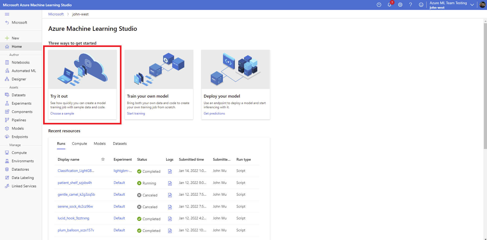

2. Review the configuration and click `Run sample job`

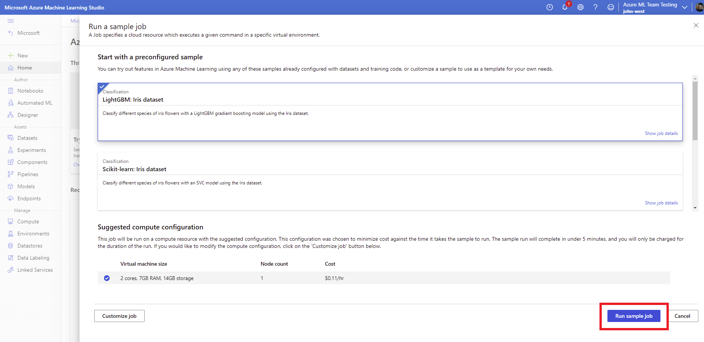

3. Wait for the job to queue, and then it should complete in ~5 minutes.

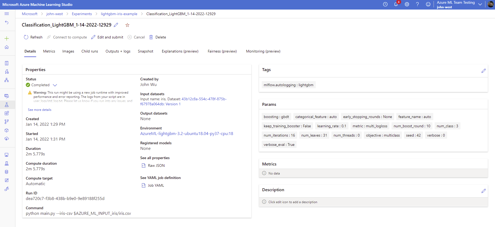

### Submit a job using a custom script 

For your convenience, this repository includes a training script that can be used as an example to run the job. Steps `3-4` are defaulted to use the provided training script. If using your own code, make sure to fill out the parameters accordingly based on your scenario.

1. Navigate to the <a href="https://master.ml.azure.com/?wsid=/subscriptions/4aaa645c-5ae2-4ae9-a17a-84b9023bc56a/resourceGroups/john/providers/Microsoft.MachineLearningServices/workspaces/john-west&flight=clusterlesscompute,clusterlesscomputerun,aml5minstowow&tid=72f988bf-86f1-41af-91ab-2d7cd011db47" target="_blank">Azure ML Studio UI</a> and click on the `Train your own model` card.

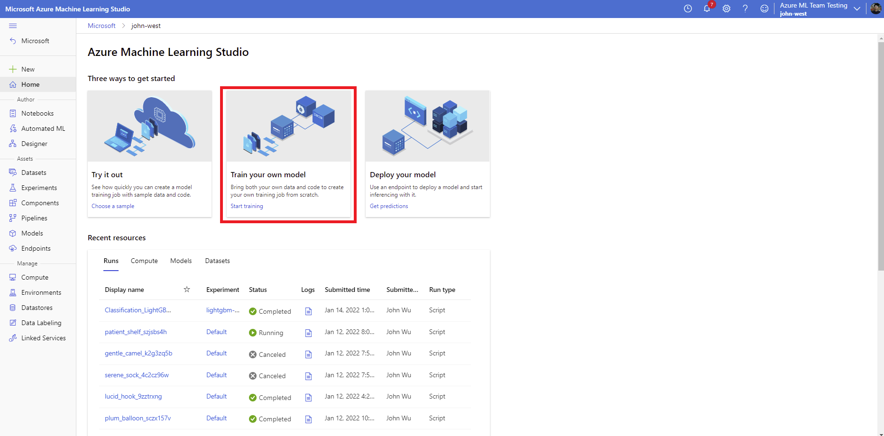

2. Make sure that `Automatic (Preview)` is selected as the compute type. Select your compute requirements and click `Next`.

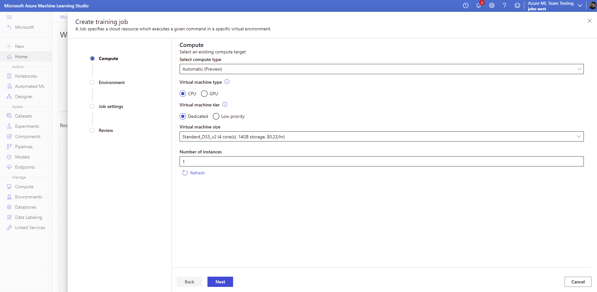

3. Select the `TensorFlow 2.4` environment and click `Next`

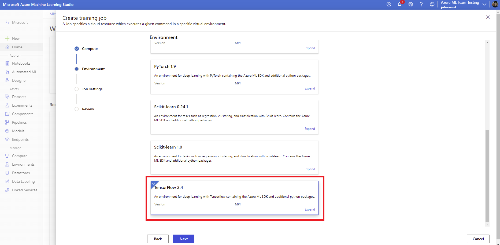

4. Upload the attached `train.py` file, enter `python train.py` as the start command, and click `Next`.

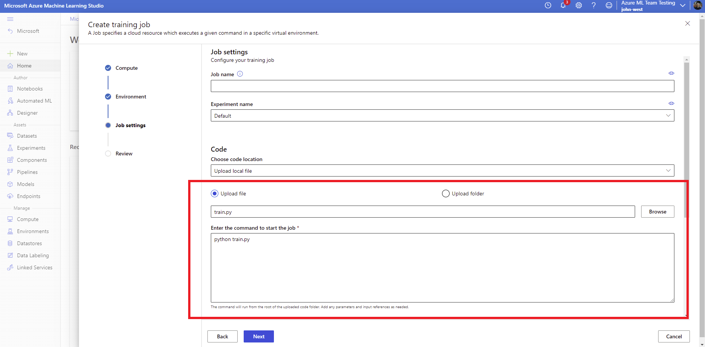

5. Review your settings and click `Create`

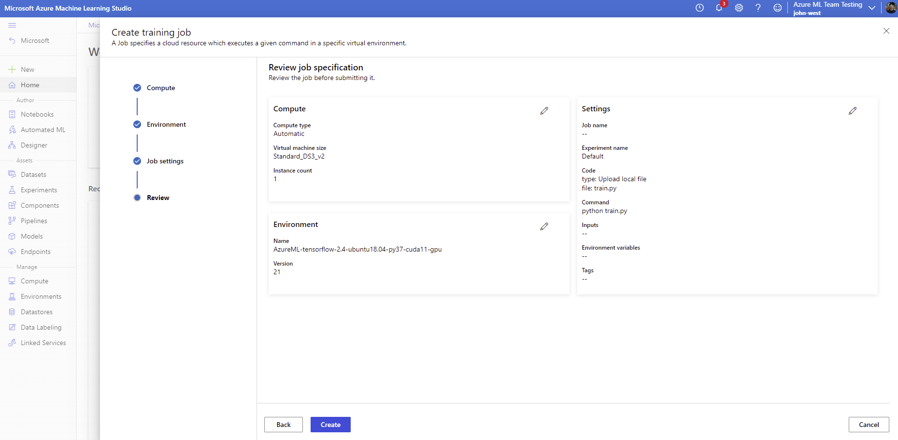

6. Wait for the job to prepare. This may take a couple minutes if a job has not been submitted for awhile.

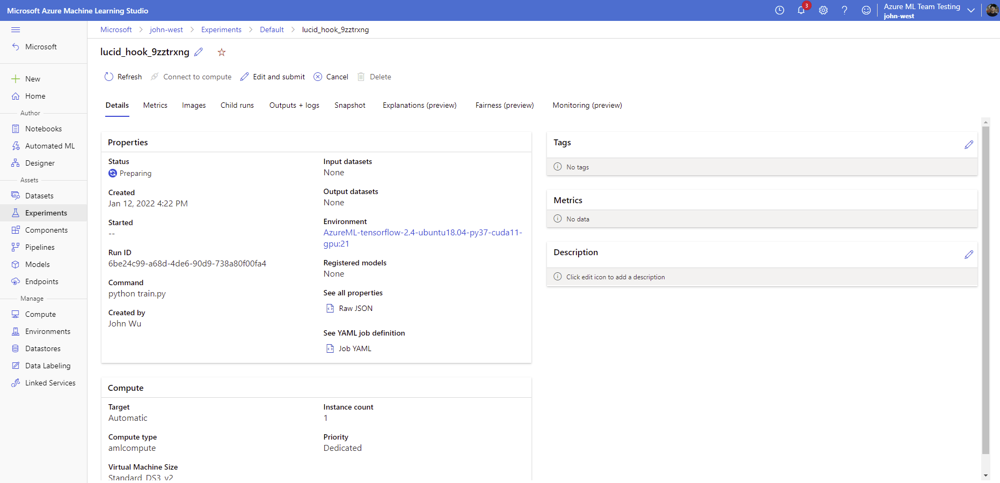

7. Once the job starts, you should be able to see metrics, logs, and monitoring information like with any other Azure ML job.

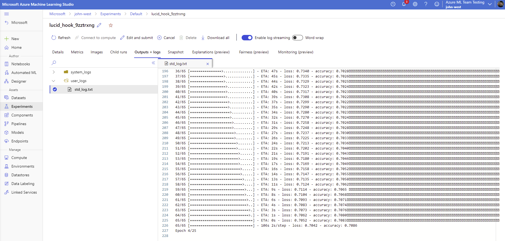

## How to submit feedback

To submit feedback, please use the built-in feedback tool in the Azure ML Studio UI.

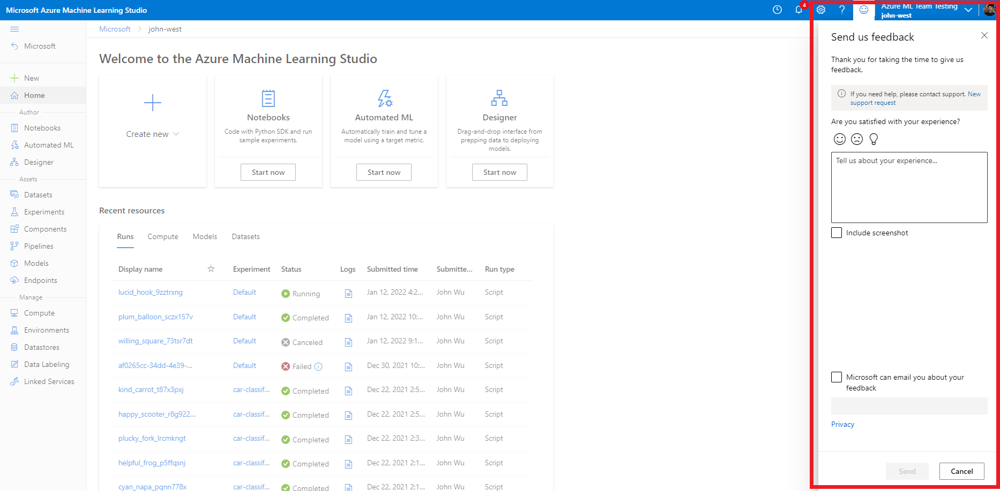